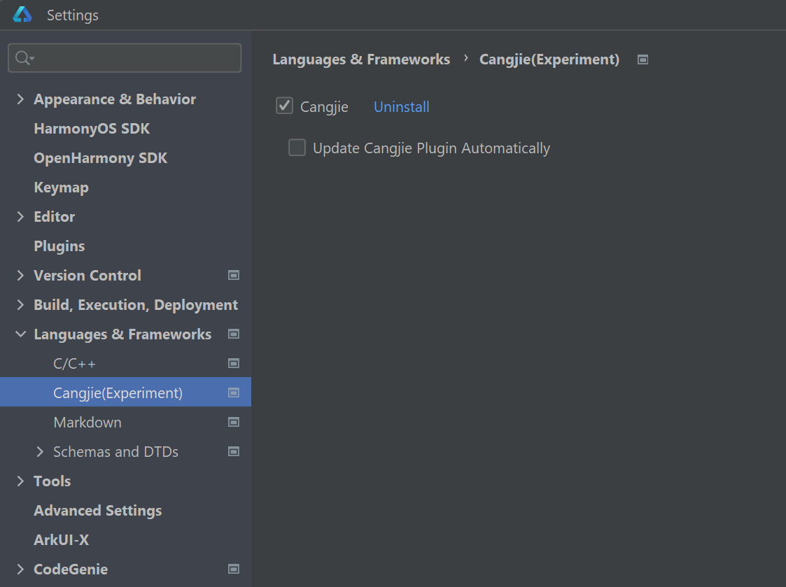
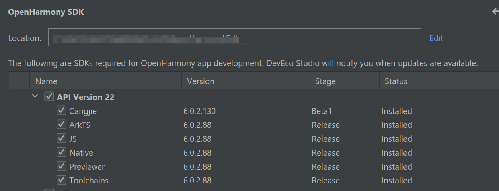
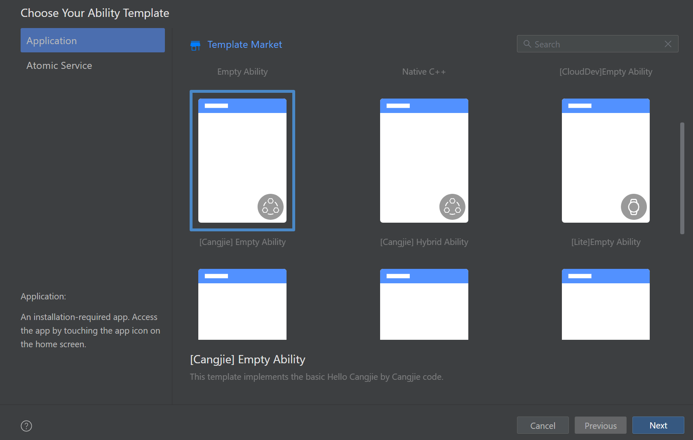

# Building Your First Cangjie Application on OpenHarmony

## Prerequisites

1. Before building your first Cangjie application, both the OpenHarmony SDK environment and the Cangjie language support must be prepared in advance.  
At present, DevEco Studio only provides OpenHarmony SDK packages up to API 20 through the SDK Manager, while this guide requires OpenHarmony API level 22. In addition, Cangjie language support must be enabled manually by installing the corresponding plugin.

    ### Required Tools
    - **DevEco Studio**
    - Install the **latest version of DevEco Studio**.
    - Download: https://developer.huawei.com/consumer/cn/download/

2. Start by installing the latest version of DevEco Studio. After installation, launch the IDE and sign in to your Huawei account from the upper-right corner. Cangjie support is currently available only to Huawei accounts registered with a mainland China (+86) phone number. You must apply for the Cangjie beta developer program and enable the **Cangjie (experiment)** option for your account before the plugin can be installed.

3. After signing in, open **Settings / Preferences** in DevEco Studio and navigate to **Languages & Frameworks**. In the list of available options, locate **Cangjie (experiment)** and enable it. Once selected, DevEco Studio will automatically download and install the Cangjie plugin. After the download is complete, restart the IDE to finish the installation.

   

4. You can verify that the Cangjie plugin has been installed successfully by creating a new project. If Cangjie-related templates are available for selection in the project creation wizard, the installation has completed successfully.

5. Next, configure the OpenHarmony SDK. In DevEco Studio, go to **Settings / Preferences**, then navigate to **SDK > OpenHarmony SDK**. Select or create a directory and bind it as the OpenHarmony SDK path. This directory will be used to store OpenHarmony SDK files for different API versions.

6. Locate the DevEco Studio installation directory on your system and find the following path:  
`<DevEco Studio Install Path>/sdk/default/openharmony`

7. This directory contains the built-in OpenHarmony SDK files that can be reused for higher API levels. Copy all contents of this directory. In the directory that you bound as the OpenHarmony SDK path, create a new folder named `22`, then paste all copied files into this folder. After the files are copied, ensure that the OpenHarmony SDK path contains a `22` directory with subdirectories `ets`,`native`,`previewer`, `js` and `toolchains`. 

8. After the OpenHarmony SDK files are copied, the Cangjie SDK must also be placed into the same API-level directory. Once the Cangjie plugin is successfully installed, the Cangjie SDK is automatically downloaded. On Windows, the SDK is installed by default under the user directory at `~/.cangjie-sdk`. Navigate into this directory, enter the `6.0` folder, and locate the `cangjie` directory.

9. Copy the entire `cangjie` directory and paste it into the OpenHarmony SDK `22` directory that you created earlier. The `cangjie` directory should be placed at the same level as directories such as `js`, `native`, and other existing SDK components. After this step, the OpenHarmony SDK path should contain a complete API 22 environment with both OpenHarmony and Cangjie SDK components available. 
   


10. Restart DevEco Studio to ensure that all SDK configurations take effect. Once completed, OpenHarmony SDK API level 22 with Cangjie support can be used during project synchronization and build.


## Creating a Cangjie Project

1. If opening **DevEco Studio** for the first time, click **Create Project** to start. If a project is already open, select **File** > **New** > **Create Project** from the menu bar.

2. Choose **Application** development (this guide focuses on application development; Cangjie currently doesn't support meta-service development). Select the **[Cangjie] Empty Ability** template and click **Next** to proceed.

   

3. On the project configuration screen, you can modify basic settings like project name and storage path or keep the defaults.

4. Click **Finish** to complete project creation. The IDE will automatically generate foundational sample code and related resources.

5. After the project is created, perform the following operations to modify related fields in the project-level **build-profile.json5** file (at the same directory level as **entry**):
   
   1. Add the **compileSdkVersion** field.

   2. Set the value of **compatibleSdkVersion** and **compileSdkVersion** to an integer, such as **22**, **23**.

   3. Change the **runtimeOS** field from **HarmonyOS** to **OpenHarmony**.

   ```json
   "products": [
     {
       "name": "default",
       "signingConfig": "default", 
       "targetSdkVersion": 22,
       "compileSdkVersion": 22,    // Version for compiling the OpenHarmony application or atomic service.
       "compatibleSdkVersion": 22, // Minimum version compatible with the OpenHarmony application or atomic service.
       "runtimeOS": "OpenHarmony",
     }
   ],
   ```

6. Click **Sync Now** to start synchronization.

   In the **Sync Check** dialog box, click **Yes** to switch the phone type in the **module.json5/config.json** file to the default type supported by the OpenHarmony, and delete other device types that are not applicable to the OpenHarmony. The OpenHarmony project is created if the synchronization is successful and no other error is reported.

## Cangjie Project Directory Structure

The Cangjie project directory structure is as follows:

```text
Project_name
├── .hvigor
├── .idea
├── AppScope
├── entry
│    ├── libs
│    ├── src
│    │    ├── main
│    │    │    ├── cangjie
│    │    │    │    ├── ability_stage.cj
│    │    │    │    ├── index.cj
│    │    │    │    └── main_ability.cj
│    │    │    ├── resources
│    │    │    └── module.json5
│    │    └── ohosTest
│    ├── build-profile.json5
│    ├── cjpm.toml
│    ├── hvigorfile.ts
│    └── oh-package.json5
├── hvigor
│    └── hvigor-config.json5
├── oh_modules
├── build-profile.json5
├── code-linter.json5
├── hvigorfile.ts
├── local.properties
├── oh-package.json5
└── oh-package-lock.json5
```

Key file descriptions:

- **AppScope > app.json5**: Global application configuration.
- **entry**: Cangjie project module that compiles into a HAP package.
    - **src > main > cangjie**: Stores Cangjie source code.
    - **src > main > resources**: Contains resource files (graphics, multimedia, strings, layouts, etc.). See [Resource Classification and Access](../ide-resource-categories-and-access.md#资源分类与访问).
    - **src > main > module.json5**: Stage module configuration including HAP settings, device-specific configurations, and global app settings.
    - **build-profile.json5**: Module-level build configurations (buildOption, targets, etc.).
    - **hvigorfile.ts**: Module-level build script.
    - **cjpm.toml**: Cangjie package management configuration.
    - **oh-package.json5**: Package metadata (name, version, entry files, dependencies).
    - **src > ohosTest**: Contains Cangjie test code for Instrument Test.
- **hvigor**: Stores project-specific hvigor configurations.
    - **hvigor-config.json5**: Global hvigor configuration and parameters.
- **oh_modules**: Stores third-party library dependencies.
- **build-profile.json5**: Application-level configurations (signing, product settings).
- **hvigorfile.ts**: Application-level build script.
- **oh-package.json5**: Global configurations (dependency overrides, parameter files).

## Building the First Page

1. Using text components.

   After project synchronization, navigate to **entry > src > main > cangjie** in the **Project** window and open **index.cj** to write your page in Cangjie. This example uses Row and Column components for layout.

   ```text
   entry
   └── src
        └── main
             ├── cangjie
             │    ├── ability_stage.cj
             │    ├── index.cj
             │    └── main_ability.cj
             ├── resources
             └── module.json5
   ```

   Initial **index.cj** code:

   <!-- compile -->

   ```cangjie
   // index.cj
   package ohos_app_cangjie_entry

   import kit.ArkUI.*
   import ohos.arkui.state_macro_manage.*

   @Entry
   @Component
   class EntryView {
       @State
       var message: String = "Hello World"
       func build() {
           Row {
               Column {
                   Text(this.message)
                       .fontSize(50)
                       .fontWeight(FontWeight.Bold)
                       .onClick ({
                           evt => this.message = "Hello Cangjie"
                       })
               }.width(100.percent)
           }.height(100.percent)
       }
   }
   ```

2. Adding text and modifying buttons.

   Add a Button component to enable page navigation. Updated **index.cj**:

   <!-- compile -->

   ```cangjie
   // index.cj
   package ohos_app_cangjie_entry

   import kit.ArkUI.*
   import ohos.arkui.state_macro_manage.*

   @Entry
   @Component
   class EntryView {
       @State
       var message: String = "Hello Cangjie"

       func build() {
           Row {
               Column() {
                   Text(this.message)
                    .fontSize(50)
                    .fontWeight(FontWeight.Bold)
                    .onClick ({
                        evt => this.message = "Hello Cangjie"
                    })
                   // Add button for user interaction
                   Button("Next")
                   .onClick ({
                       evt => Hilog.info(1, "info", "Hello Cangjie")
                   })
                   .fontSize(30)
                   .width(180)
                   .height(50)
                   .margin(top: 20)
               }.width(100.percent)
           }.height(100.percent)
       }
   }
   ```

## Building the Second Page

1. Creating the second page.

   Right-click the **cangjie** folder (**entry > src > main > cangjie**), select **New > Cangjie File**, name it **second**, and click **OK**.

   ```text
   entry
   └── src
        └── main
             ├── cangjie
             │    ├── ability_stage.cj
             │    ├── index.cj
             │    ├── main_ability.cj
             │    └── second.cj
             ├── resources
             └── module.json5
   ```

2. Adding text and buttons.

   Similar to the first page, add components in **second.cj**:

   <!-- compile -->

   ```cangjie
   // second.cj
   package ohos_app_cangjie_entry

   import ohos.arkui.state_macro_manage.Entry
   import ohos.arkui.state_macro_manage.Component
   import ohos.arkui.state_macro_manage.State
   import ohos.arkui.state_macro_manage.r
   import ohos.arkui.component.Button
   import ohos.hilog.Hilog
   import kit.ArkUI.*

   @Entry
   @Component
   class Second {
       @State
       var message: String = "Hi there"

       func build() {
           Row {
               Column() {
                   Text(this.message)
                       .fontSize(50)
                       .fontWeight(FontWeight.Bold)
                   Button("Back")
                       .onClick ({
                           evt => Hilog.info(1, "info", "Hi there")
                       })
                       .fontSize(30)
                       .width(180)
                       .height(50)
                       .margin(top: 20)
               }.width(100.percent)
           }.height(100.percent)
       }
   }
   ```

## Implementing Page Navigation

Page navigation uses the router module to find target pages via URLs.

1. Navigating from first to second page.

   Update **index.cj** with router functionality:

   <!-- compile -->

   ```cangjie
   // index.cj
   package ohos_app_cangjie_entry

   import kit.ArkUI.*
   import ohos.arkui.state_macro_manage.*

   @Entry
   @Component
   class EntryView {
       @State
       var message: String = "Hello Cangjie"

       func build() {
           Row {
               Column() {
                   Text(this.message)
                    .fontSize(50)
                    .fontWeight(FontWeight.Bold)
                    .onClick ({
                        evt => this.message = "Hello Cangjie"
                    })
                   Button("Next")
                   .onClick ({
                       evt => getUIContext().getRouter().pushUrl(url: "Second") // Navigate to second page
                   })
                   .fontSize(30)
                   .width(180)
                   .height(50)
                   .margin(top: 20)
               }.width(100.percent)
           }.height(100.percent)
       }
   }
   ```

2. Returning from second to first page.

   Update **second.cj** with back navigation:

   <!-- compile -->

   ```cangjie
   // second.cj
   package ohos_app_cangjie_entry

   import ohos.arkui.state_macro_manage.Entry
   import ohos.arkui.state_macro_manage.Component
   import ohos.arkui.state_macro_manage.State
   import ohos.arkui.state_macro_manage.r
   import ohos.arkui.ui_context.* // Import router module
   import ohos.hilog.Hilog
   import kit.ArkUI.*

   @Entry
   @Component
   class Second {
       @State
       var message: String = "Hi there"

       func build() {
           Row {
               Column() {
                   Text(this.message)
                       .fontSize(50)
                       .fontWeight(FontWeight.Bold)
                   Button("Back")
                       .onClick ({
                           evt => getUIContext().getRouter().back(url: "EntryView") // Return to first page
                       })
                       .fontSize(30)
                       .width(180)
                       .height(50)
                       .margin(top: 20)
               }.width(100.percent)
           }.height(100.percent)
       }
   }
   ```

## Running on Device or Emulator

### Running on Physical Device

1. Connect an OpenHarmony device to your computer.

2. After successful connection, go to **File > Project Structure > Project > Signing Configs**, check **Automatically generate signature**, click **Sign In** to log in. After automatic signing completes, click **OK**.

3. Click the run button in the top-right toolbar to run. Expected output:

### Using Emulator

Cangjie applications support running on DevEco Studio's emulator.

1. Create a Phone-type emulator device and select it from the device list.

2. By default, Cangjie compiles for **arm64-v8a**. For **x86 emulators** (Windows/x86_64 or MacOS/x86_64), add "**x86_64**" to **abiFilters** in **build-profile.json5**:

   ```json
   "buildOption": {      // Build configuration
     "cangjieOptions": { // Cangjie-specific settings
       "path": "./cjpm.toml", // cjpm config path
       "abiFilters": ["arm64-v8a", "x86_64"]   // Custom architectures
     }
   }
   ```

3. Click run button to run. Output matches physical device results.


## Emulator Error Caused by Incomplete OpenHarmony OS SDK

1. When running the project on an **emulator**, you may encounter an error.  
This happens because the current **OpenHarmony OS SDK** is copied from the **IDE installation directory**, and **is not a complete OpenHarmony OS SDK**.

2. As a result, some required **SysCaps (System Capabilities)** are missing when the application is launched on the emulator.

### Solution

1. To resolve this issue, you need to manually add a `syscap.json` file. Please create a new `syscap.json` file in the following directory: Entry/src/main

2. The `syscap.json` file should be placed **at the same level as the `cangjie` directory**.

### Example `syscap.json`

1. Below is an example of the `syscap.json` file.  
You can **add or remove SysCaps as needed** depending on your project requirements.

    ```json
    {
    "devices": {
        "general": ["default"]
    },
    "production": {
        "removedSysCaps": [
        "SystemCapability.Multimedia.Media.AVTranscoder",
        "SystemCapability.Telephony.CellularData",
        "SystemCapability.Communication.Bluetooth.Core",
        "SystemCapability.Telephony.CoreService",
        "SystemCapability.Telephony.StateRegistry",
        "SystemCapability.Telephony.SmsMms",
        "SystemCapability.Telephony.CallManager",
        "SystemCapability.DistributedHardware.DeviceManager",
        "SystemCapability.Multimedia.Drm.Core",
        "SystemCapability.Advertising.Ads",
        "SystemCapability.BundleManager.AppDomainVerify",
        "SystemCapability.Customization.EnterpriseDeviceManager"
        ]
    }
    }
