# Cangjie Partner & Developer Conference (Shenzhen): Building a Native Software Ecosystem

The Cangjie Partner & Developer Conference made its Shenzhen stop on April 24, 2026, hosted at the HarmonyOS Ecosystem Tower (Shenye Taifu Science & Innovation Building) in Luohu District. Themed **"Building a Native Software Ecosystem: Exploring the Cangjie + HarmonyOS + Multi-Industry Innovation Path,"** the event brought together government officials, Huawei executives, financial institutions, technology companies, universities, and open-source community members to advance Cangjie's ecosystem development and industry adoption.

## Opening Remarks: Cangjie as Strategic Infrastructure

The conference opened with remarks from a Luohu District government representative, who framed the stakes clearly: global competition in information technology has now penetrated down to the foundational software layer, making operating systems and programming languages core assets of digital competitiveness. As HarmonyOS's official programming language, Cangjie provides end-to-end, domestically controlled capability, from the language runtime all the way up to application delivery.

Shenzhen has designated the Luohu Sunggang–Qingshuihe area as a dedicated "Operating System Ecosystem Cluster," and over the past year Luohu has moved quickly: the HarmonyOS Ecosystem Tower is operational, an OpenHarmony Application Innovation Centre has been established, the landmark "HarmonyOS Seven Policies" have been launched, and a first wave of real-world HarmonyOS deployment scenarios, spanning government services, water utilities, and commercial parking, are already live. The vision is a self-reinforcing cycle: R&D and adaptation, scenario deployment, and enterprise clustering feeding each other.

Looking ahead, Luohu pledged to be the most fertile ground for the Cangjie ecosystem, offering R&D subsidies, workspace support, and talent incentives for Cangjie and HarmonyOS companies; piloting Cangjie applications across its dense concentration of financial, retail, medical, and education settings; and leveraging the HarmonyOS Ecosystem Tower and Innovation Centre to close the loop between language R&D, open-source co-development, talent cultivation, and capital empowerment.

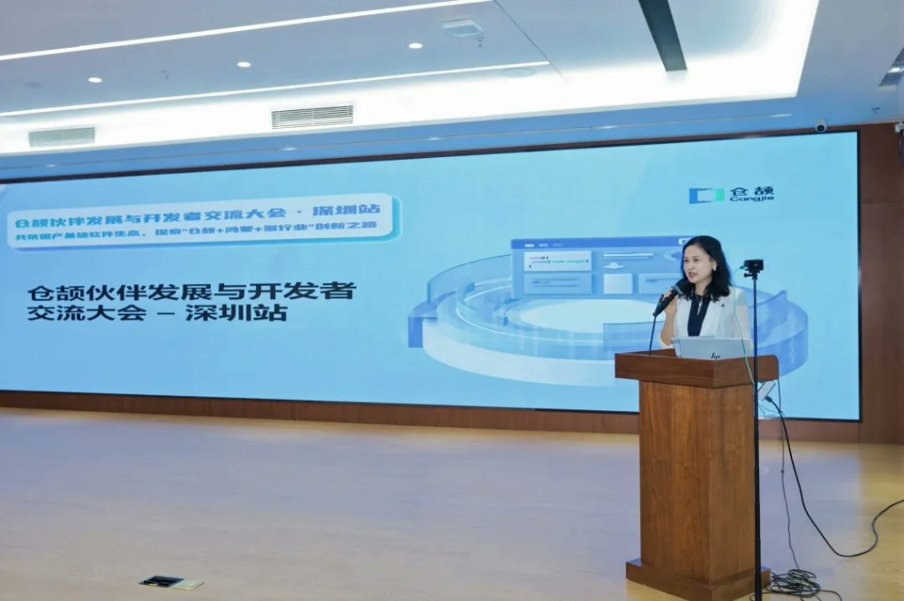

## Shenzhen Jiechuang Co. Launch Ceremony

Immediately following the opening remarks, the conference witnessed the founding ceremony of Shenzhen Jiechuang Technology, marking a significant step in deepening Cangjie's presence across South China. Jiechuang, now resident at the OpenHarmony Application Innovation Centre, was co-founded by Wang Yang, formerly Chief Healthcare Consultant of Huawei's Public Sector Business Unit. The launch was attended by Luohu District government leadership alongside Huawei's Cangjie Programme Director Dong Xin, Programming Language Lab Director Tu Le, and Cangjie Ecosystem & Industry Development Director Wang Xuezhi.

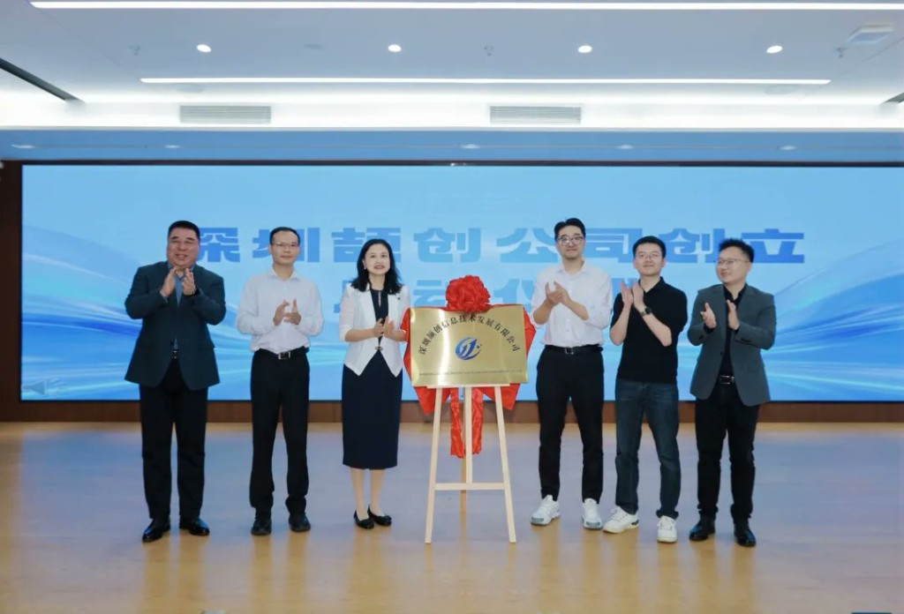

## Ecosystem Progress: State of Cangjie

Wang Xuezhi delivered a keynote surveying the latest milestones in Cangjie's ecosystem strategy, covering partner network expansion, industry collaboration, and developer support programmes. His presentation set the broader context for the practitioner-led sessions that followed.

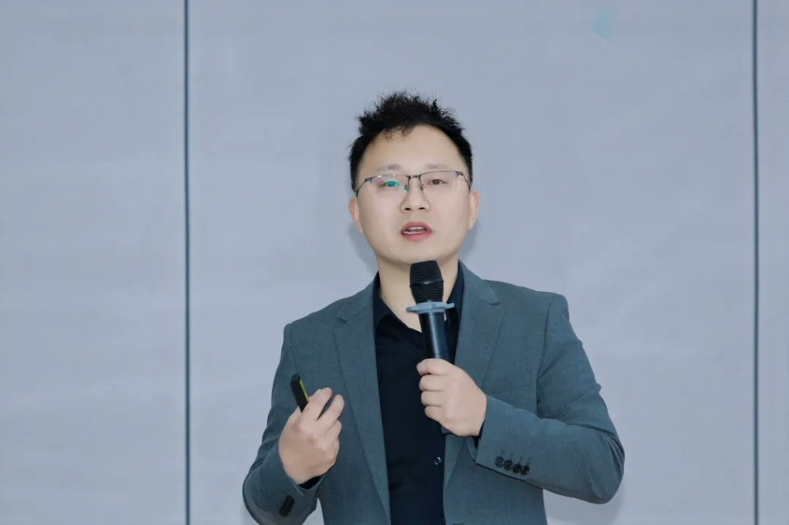

## Industry Deep-Dives: Healthcare and Finance

Two major verticals took centre stage in the afternoon sessions.

**Cangjie in Healthcare, Zhuo Yi Information:** Zhuo Yi CTO Xie Zhi presented real-world Cangjie deployments in the healthcare sector, illustrating the commercial value of building on a domestically controlled technology stack.

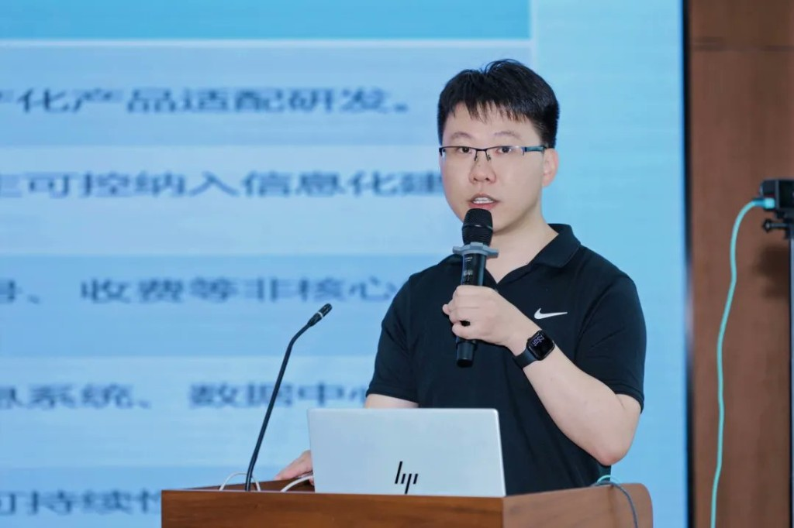

**Cangjie in Finance, ICBC:** Researcher Li Ke from the Internet Finance Research Team at Industrial and Commercial Bank of China's Software Development Centre shared ICBC's experience developing enterprise-grade HarmonyOS native applications in Cangjie, a compelling demonstration of the language's readiness for large-scale financial infrastructure.

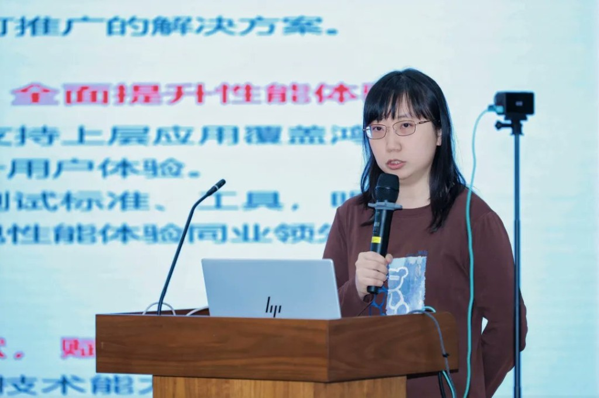

## AI and Open Source: Two Parallel Tracks

**AI for Cangjie:** Huawei's Cangjie Programme Director Dong Xin and language evangelist Liu Junjie delivered a joint session on integrating AI into the Cangjie development experience, exploring how AI tooling can amplify the language ecosystem.

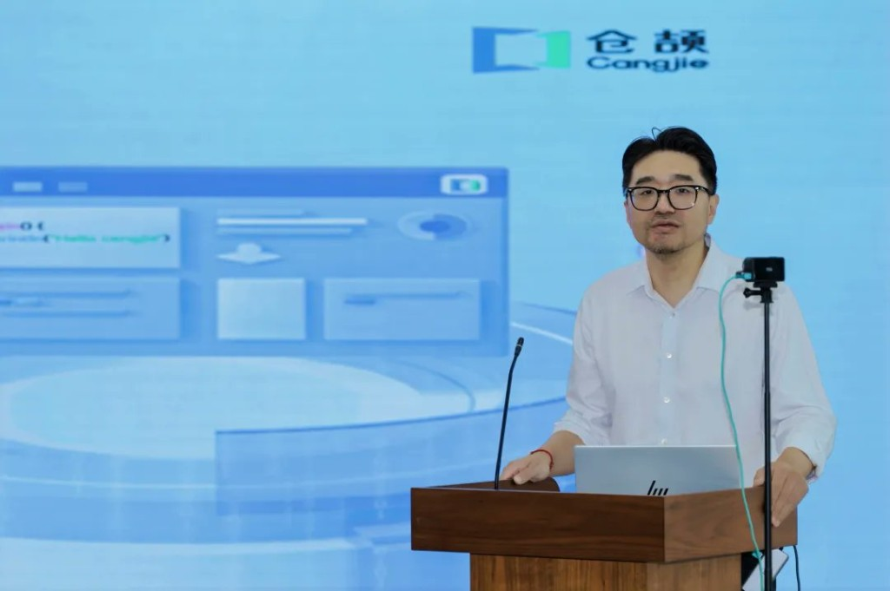

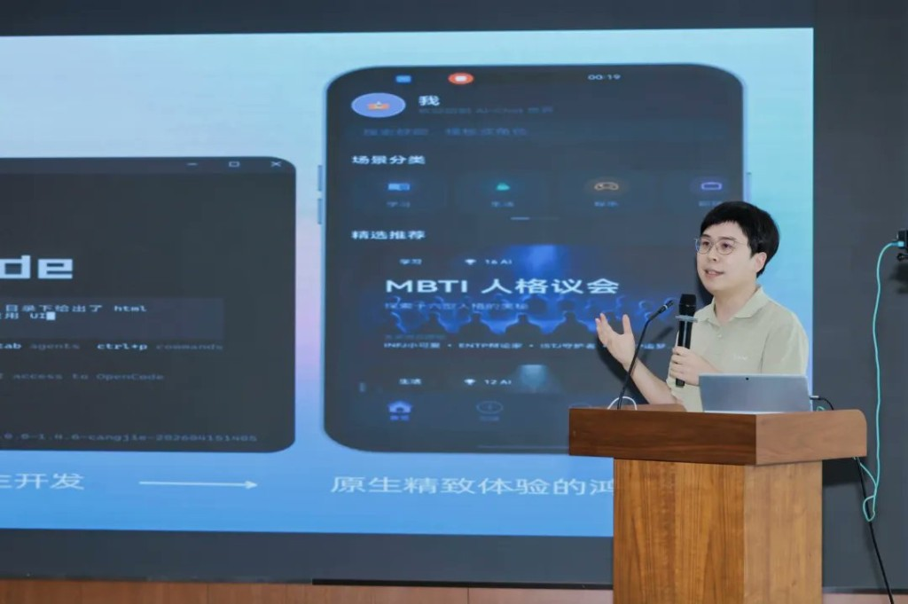

**AtomGit Open Source Community:** AtomGit Shenzhen General Manager Xu Jianguo introduced how AtomGit is actively supporting Cangjie's open-source growth, providing developers with richer resources and collaborative infrastructure.

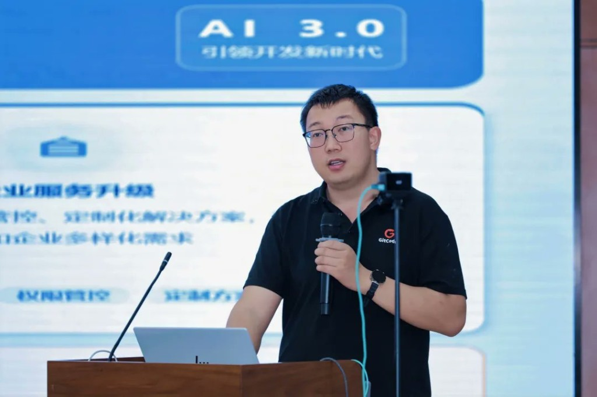

## Academia Meets Industry

**Cangjie in the Classroom:** Associate Professor Zhang Yalin from Shenzhen Polytechnic University, a Shenzhen high-level talent awardee, shared her experience building Cangjie digital textbooks and integrating the language into university curricula, working to cultivate the next generation of talent in China's homegrown software stack.

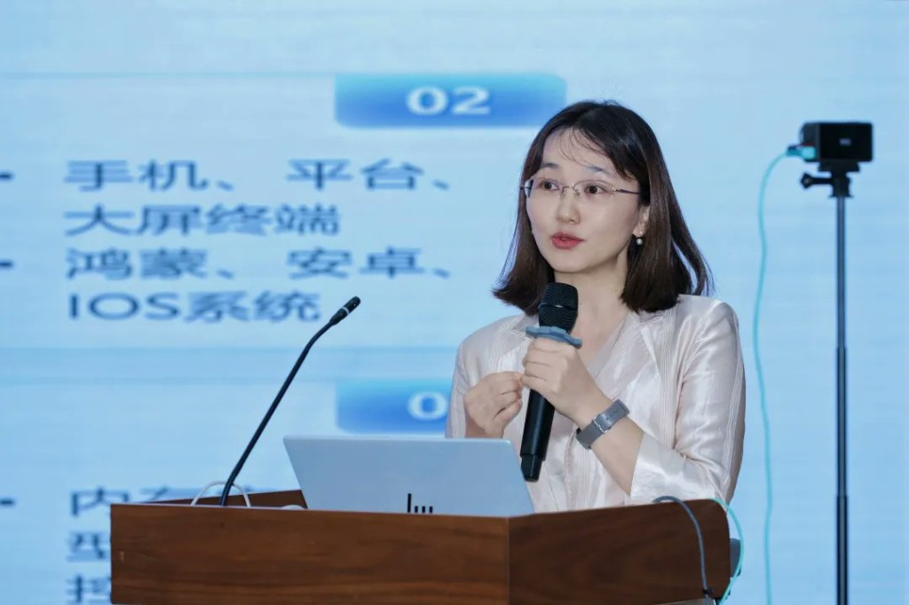

**Spire/Tianjing Web Framework:** Xu Jiayi, co-founder of Hangzhou Jiechuang Technology and lead engineer of the Tianjing framework, presented on Cangjie's growing web development capabilities, showcasing a maturing framework ecosystem.

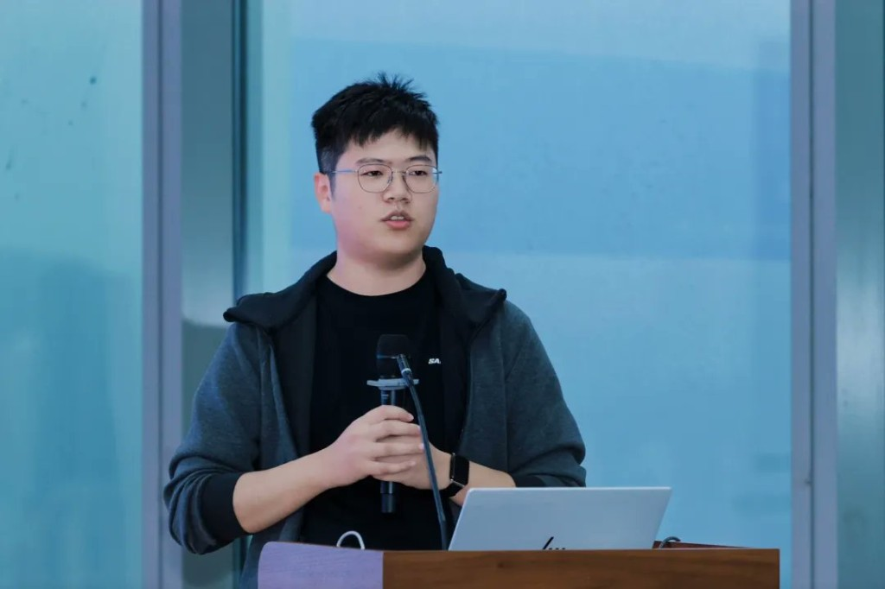

**Cangjie Agent Framework Design:** Wang Zhipeng, founder of the OpenCangjie open-source community and author of AgentSkills-runtime, shared the design philosophy behind Cangjie's intelligent agent framework, offering a fresh technical and conceptual perspective on building AI agents with Cangjie.

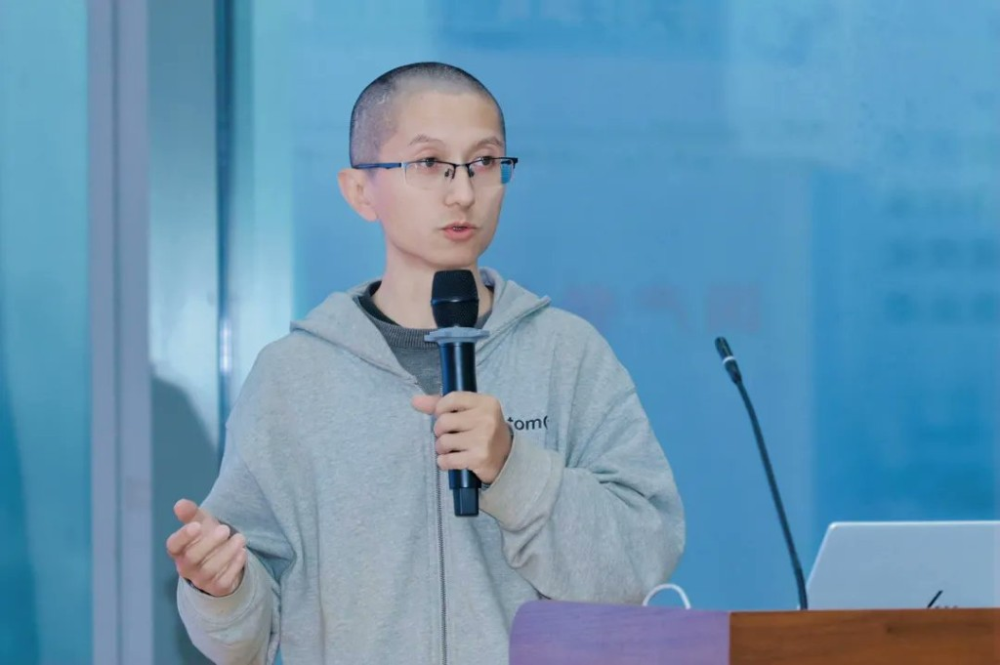

## Regional Vision: Luohu as Cangjie's Southern Base

The conference closed with a forward-looking presentation by Wang Yang, founder of Shenzhen Jiechuang, outlining a development roadmap for growing the Cangjie industry cluster in Luohu District, a blueprint for turning policy ambition into a living, self-sustaining ecosystem.

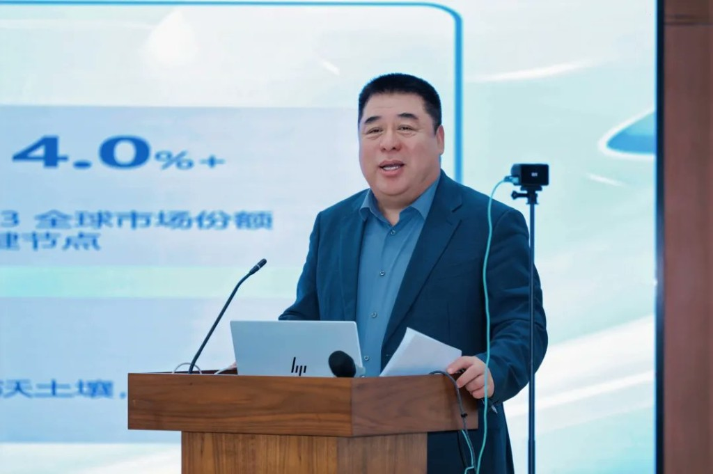

## Looking Ahead

The Shenzhen conference extended Cangjie's developer reach and gave concrete momentum to the Cangjie + HarmonyOS + multi-industry innovation thesis. Full session recordings will be released shortly on the official Cangjie Programming Language video channel.
