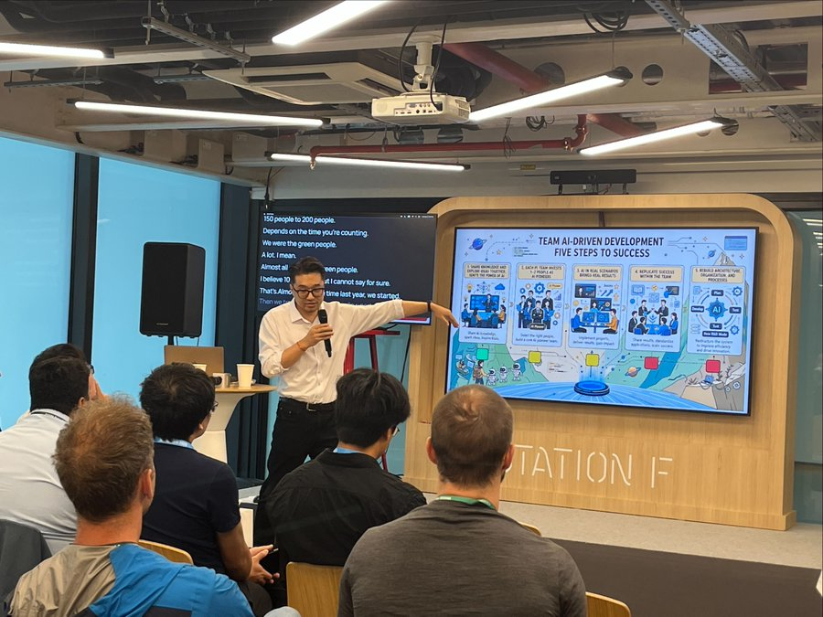

240–2600% productivity gains. Not a benchmark. Not a demo. A real 300-day transformation inside Huawei's Cangjie compiler team.

SeanXDO is on stage at GOSIM Paris 2026 today at Founders Cafe and tomorrow at Junior Stage to break down the ACE model — what failed, and what actually stuck.

## Schedule

- **5 May 2026 · 15:40–16:00 · Founders Cafe**
  [Agents, Code & Parallel Worlds: The 300-Day Agentic Evolution of Cangjie Programming Language Team](https://paris2026.gosim.org/zh/schedule/agents-code-parallel-worlds-the-300-day-agentic-evolution-of-cangjie-programming-language-team/)

- **6 May 2026 · 10:20–10:45 · Junior Stage**
  [Agents, Code & Parallel Worlds (Agentic OS App)](https://paris2026.gosim.org/zh/schedule/agents-code-parallel-worlds-the-300-day-agentic-evolution-of-cangjie-programming-language-team-agentic-os-app/)

📍 Station F, Paris
